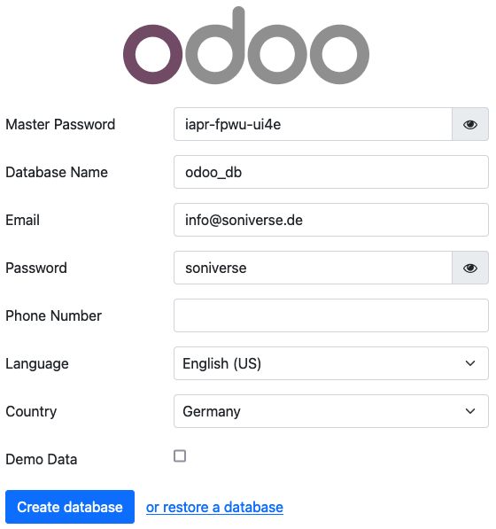

# Odoo

## enable "developer mode"

Before you can start developing new custom modules for Odoo the developer mode has to be enabled. Go to "Settings" (
could be found on the left upper corner, nine squares!). Inside the "General Settings" menu scroll down until the end is
reached and press "Activate the developer mode". If this is done an automatic redirect to the "Apps" view will be
triggered. Now on the toolbar at the top "Update Apps List" can be clicked!

## creating custom modules for configuration

When a new custom module should be created for new feature or configuration, then create a new folder inside the
"odoo_addons" directory. Now create the custom addon structure and start developing. Through the following make commands
the new addon can be updated into the Odoo system and, when there are tests, they can be executed:

| command             | description                                  |
|---------------------|----------------------------------------------|
| make update-addons  | update all addons inside the addons folder   |
| make run-odoo-tests | run all tests of the addons and show results |

## docker environment for development

For an easy development process there are some helpful make command are available. The commands are described in the
following:

| command                       | description                                                         |
|-------------------------------|---------------------------------------------------------------------|
| make start-docker-container   | starts all Docker container defined in configuration                |
| make stop-docker-container    | stops all Docker container defined in configuration                 |
| make restart-docker-container | restart all Docker container defined in configuration               |
| make status-docker-container  | show status of all stated Docker container defined in configuration |
| make log-docker-container     | show log of the Docker container by the given name, name=odoo       |
| make clean-docker-container   | clean Docker container and remove data folder (be careful!)         |
| make help                     | show information of all existing Make commands                      |

## installation details

To test the existing and new addons use the following account information to login into local Odoo instance:

**Master Password (for installation only!):** `iapr-fpwu-ui4e`

**Database Name:** `odoo_db`

**Username:** `info@soniverse.de`

**Password:** `soniverse`

